# GitHub Actions CI/CD Setup

## Workflows Created ✅

### 1. **Tests** (`.github/workflows/tests.yml`)
**Triggers:** Push/PR to `main` or `develop`

**What it does:**
- Runs tests across multiple OS (Ubuntu, macOS, Windows)
- Tests Python versions: 3.10, 3.11, 3.12
- Generates coverage report
- Uploads to Codecov

**Matrix Testing:**
```yaml
os: [ubuntu-latest, macos-latest, windows-latest]
python: ["3.10", "3.11", "3.12"]
Total: 9 test combinations
```

### 2. **Code Quality** (`.github/workflows/quality.yml`)
**Triggers:** Push/PR to `main` or `develop`

**Checks:**
- ✅ Code formatting (Black)
- ✅ Linting (Ruff)
- ✅ Security scan (Bandit)
- ✅ Type checking (mypy)

### 3. **Publish to PyPI** (`.github/workflows/publish.yml`)
**Triggers:** When you create a GitHub Release

**What it does:**
1. Builds package
2. Validates with twine
3. Publishes to PyPI automatically

**Setup Required:**
```bash
# 1. Get PyPI token
#    - Go to https://pypi.org/manage/account/token/
#    - Create new token
#    - Scope: Entire account or specific project

# 2. Add to GitHub Secrets
#    - Go to repo Settings → Secrets → Actions
#    - New repository secret
#    - Name: PYPI_API_TOKEN
#    - Value: <your token>
```

### 4. **Documentation** (`.github/workflows/docs.yml`)
**Triggers:** Push to `main` with doc changes

**What it does:**
- Checks for broken links in markdown files
- Validates documentation

---

## Usage Guide

### Running Tests Locally

```bash
# Run all tests
pytest -v

# Run with coverage
pytest --cov=fastapi_shadcn_admin --cov-report=html

# Check code quality
black --check fastapi_shadcn_admin/
ruff check fastapi_shadcn_admin/
bandit -r fastapi_shadcn_admin/ -ll
```

### Publishing Workflow

**Automatic (Recommended):**
```bash
# 1. Create and push tag
git tag -a v0.1.0 -m "Release v0.1.0"
git push origin v0.1.0

# 2. Create GitHub Release
#    - Go to GitHub → Releases → Draft new release
#    - Choose tag v0.1.0
#    - Title: "v0.1.0 - Beta Release"
#    - Description: Copy from CHANGELOG.md
#    - Publish release

# 3. GitHub Actions automatically:
#    - Runs all tests
#    - Builds package
#    - Publishes to PyPI
```

**Manual:**
```bash
# If automatic fails
python -m build
twine upload dist/*
```

### Required GitHub Secrets

Add these in: `Settings → Secrets and variables → Actions`

1. **PYPI_API_TOKEN**
   - Get from: https://pypi.org/manage/account/token/
   - Scope: Entire account or this project
   - Required for: Publish workflow

Optional (for enhanced features):
2. **CODECOV_TOKEN**
   - Get from: https://codecov.io
   - For: Coverage reporting
   - Sign up with GitHub account

---

## Status Badges

Add to README.md:

```markdown
[](https://github.com/rasinmuhammed/fastapi-matrix-admin/actions/workflows/tests.yml)
[](https://github.com/rasinmuhammed/fastapi-matrix-admin/actions/workflows/quality.yml)
[](https://codecov.io/gh/rasinmuhammed/fastapi-matrix-admin)
```

---

## Branch Protection Rules (Recommended)

**Settings → Branches → Add rule**

**For `main` branch:**
- ✅ Require pull request before merging
- ✅ Require status checks to pass:
  - `test (ubuntu-latest, 3.11)`
  - `quality`
- ✅ Require branches to be up to date
- ✅ Require linear history

---

## Workflow Files Summary

```
.github/
├── workflows/
│   ├── tests.yml          # Automated testing
│   ├── quality.yml        # Code quality checks
│   ├── publish.yml        # PyPI publishing
│   └── docs.yml           # Documentation checks
├── markdown-link-check-config.json
├── ISSUE_TEMPLATE/
│   ├── bug_report.md
│   └── feature_request.md
└── PULL_REQUEST_TEMPLATE.md
```

---

## First-Time Setup Checklist

### Before First Push:
- [ ] Initialize git: `git init`
- [ ] Add remote: `git remote add origin https://github.com/rasinmuhammed/fastapi-matrix-admin.git`
- [ ] First commit: `git add . && git commit -m "🎉 Initial release v0.1.0"`

### On GitHub:
- [ ] Create repository on GitHub
- [ ] Push code: `git push -u origin main`
- [ ] Add PYPI_API_TOKEN secret
- [ ] Enable Actions (should be automatic)
- [ ] Set up branch protection (optional)

### First Release:
- [ ] Verify tests pass on GitHub Actions
- [ ] Create tag: `git tag -a v0.1.0 -m "Beta Release"`
- [ ] Push tag: `git push origin v0.1.0`
- [ ] Create GitHub Release
- [ ] Verify PyPI publish succeeds

---

## Troubleshooting

### Tests fail on Windows
- Check path separators (use `pathlib`)
- Check line endings (set `.gitattributes`)

### PyPI publish fails
- Verify PYPI_API_TOKEN is correct
- Check package name not taken
- Ensure version number is incremented

### Badge not showing
- Wait ~5 minutes after first workflow run
- Check workflow name matches exactly
- Verify public repository

---

## Next Steps

1. **Push to GitHub:**
   ```bash
   git add .
   git commit -m "Add GitHub Actions CI/CD"
   git push
   ```

2. **Watch Actions Tab:**
   - Go to repository → Actions
   - See workflows run automatically

3. **Create First Release:**
   - Follow publishing workflow above
   - Watch automatic PyPI deployment

---

## What Happens on Each Push

```mermaid
graph TD
    A[Push to main/develop] --> B[Tests Workflow]
    A --> C[Code Quality Workflow]
    B --> D{All tests pass?}
    C --> E{Quality checks pass?}
    D -->|Yes| F[✅ Green checkmark]
    D -->|No| G[❌ Red X]
    E -->|Yes| F
    E -->|No| G
    
    H[Create Release] --> I[Publish Workflow]
    I --> J[Build Package]
    J --> K[Publish to PyPI]
    K --> L[🎉 Live on PyPI!]
```



---

## ✅ CI/CD Setup Complete!

**What you have:**
- Automated testing (9 combinations)
- Code quality enforcement
- Automatic PyPI publishing
- Documentation validation
- Professional workflows

**Ready to push!** 🚀
